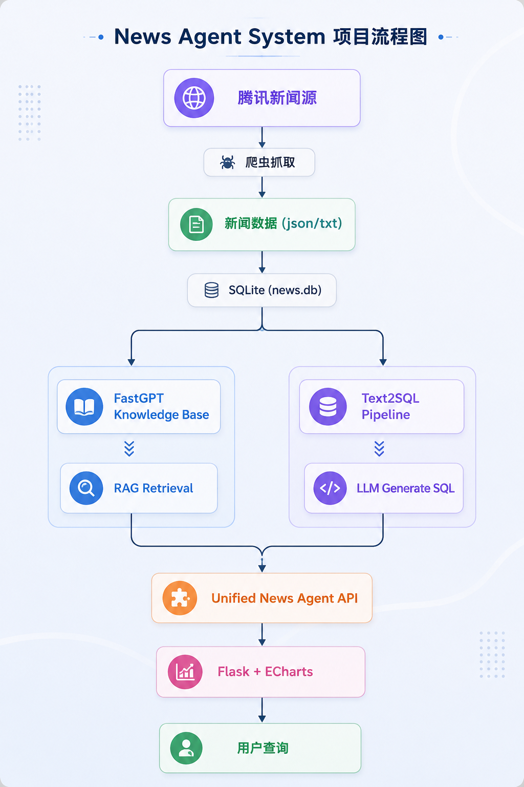

# AI News Agent System

本项目主要用于 AI Agent / RAG / Text2SQL 工程实践与研究。

一个基于 **RAG + Text2SQL + 自动化数据 Pipeline** 的智能新闻知识库系统。

项目实现了：

* 腾讯新闻自动爬取
* JSONL → SQLite 自动导入
* FastGPT 知识库自动同步
* RAG 新闻问答
* Text2SQL 数据分析
* Flask Dashboard 可视化
* 定时任务自动更新

---

# 1. 项目架构

<p align="center">
  
</p>


---

# 2. 技术栈

## Backend

* Python
* Flask
* SQLite
* Requests
* Cron

## AI / LLM

* FastGPT
* RAG
* Text2SQL
* Prompt Engineering

## Data

* JSONL
* SQLite
* Incremental Sync

## Visualization

* ECharts
* HTML/CSS

---

# 3. 核心功能

## 3.1 新闻自动采集

系统会定时抓取腾讯新闻热榜数据。

功能包括：

* 新闻标题
* 正文
* 摘要
* 发布时间
* 来源
* article_id 去重

保存格式：

```text
news_db.jsonl
```

---

## 3.2 SQLite 数据存储

新闻会自动导入 SQLite：

```text
news.db
```

核心表：

```sql
news
comments
news_clicks
users
```

### news 表核心字段

| 字段             | 作用                   
| -------------- | -------------------- 
| article_id     | 新闻唯一ID               
| title          | 标题                   
| summary        | 摘要                   
| content        | 正文                   
| retrieval_text | RAG检索文本              
| kb_synced      | 是否已同步知识库             
| kb_doc_id      | FastGPT collectionId 
| kb_synced_at   | 同步时间                 

---

## 3.3 FastGPT 知识库同步

系统会自动同步新增新闻到 FastGPT。

同步流程：

```text
SQLite
→ 查询 kb_synced=0
→ FastGPT Dataset API
→ 返回 collectionId
→ 更新数据库状态
```

实现：

```python
kb_synced = 1
kb_doc_id = collectionId
kb_synced_at = 当前时间
```

支持：

* 增量同步
* 自动去重
* 状态追踪

---

## 3.4 RAG 新闻问答

用户可以直接提问，比如：

```text
讲一下徐留平的新闻
最近有什么热点
DeepSeek最近发生了什么
```

系统流程：

```text
用户问题
→ FastGPT 检索
→ 召回相关新闻
→ LLM 基于召回内容回答
```

### 检索优化

当前配置：

* Hybrid Search（混合检索）
* Semantic + FullText
* Query Rewrite
* 低相关度阈值

---

## 3.5 Text2SQL 数据分析

对于统计类问题：

```text
最近7天新闻数量
点击量最高的新闻
评论最多的新闻
不同来源新闻数量
```

系统会自动走：

```text
LLM → SQL → SQLite → ECharts
```

### SQL 安全限制

系统会限制危险 SQL（如 DROP / DELETE / UPDATE）。

---

## 3.6 自动评测（Evaluation Pipeline）

项目包含基础 RAG 自动评测模块。

评测功能：

* 自动调用 RAG API
* 自动执行测试问题
* Alias 命中评测
* 数字匹配评测
* 模糊匹配（Fuzzy Match）
* 分类统计 Accuracy

示例测试数据：

```text
eval/test.jsonl
```

当前仓库中的 `test.jsonl` 仅保留了少量示例（约 5 个 testcase），用于展示评测格式与评测流程。

实际完整评测中，需要根据数据库中的新闻内容，构建更多问题与 reference answer，以覆盖：

* 新闻概括
* 数字细节
* 指代问题
* 多新闻分类
* 时间与事件追问

等不同类型的 RAG 问答场景。

---

# 4. 自动化 Pipeline

系统默认使用：

```bash
cron
```

定时执行：

```bash
python daily_update.py
```

daily_update.py 会自动：

```text
1. 运行新闻爬虫
2. 导入 SQLite
3. 同步 FastGPT 知识库
```

默认每次同步：

```text
5 条新增新闻
```

默认采用 cron 调度，也可替换为：

* Airflow
* APScheduler
* Celery

---

# 5. 项目亮点

## 5.1 RAG + Text2SQL 双路由

系统会自动判断：

```text
内容问答 → RAG
统计分析 → Text2SQL
```

核心逻辑：

```python
detect_query_route(question)
```

---

## 5.2 自动化数据 Pipeline

实现：

```text
新闻抓取
→ 数据清洗
→ SQLite入库
→ 知识库同步
→ 自动问答
```

无需人工维护知识库。

---

## 5.3 增量同步机制

使用：

```text
article_id
kb_synced
kb_doc_id
```

实现：

* 自动去重
* 状态追踪
* 幂等控制

---

## 5.4 Evaluation Pipeline

支持：

* 自动测试 RAG 回答
* 自动统计通过率
* 多问题类型评测
* 数字细节匹配
* Alias 命中检测

---

# 6. 项目目录

```text
news-agent/
│
├── crawler/
│   └── crawler_tencent.py
│
├── eval/
│   ├── eval_rag.py
│   └── test.jsonl
│
├── scripts/
│   └── insert_mock_data.py
│
├── tests/
│   ├── test_text2sql.py
│   └── text2sql_goldens.md
│
├── daily_update.py
├── import_news_jsonl_to_sqlite.py
├── init_db.py
├── sync_fastgpt_kb.py
├── app.py
│
├── requirements.txt
├── .env.example
├── .gitignore
└── README.md
```

---

# 7. 环境变量配置

复制：

```bash
cp .env.example .env
```

配置：

```env
FASTGPT_BASE_URL=http://127.0.0.1:3000

FASTGPT_API_KEY=
FASTGPT_DATASET_ID=

TEXT2SQL_API_KEY=
TEXT2SQL_APP_ID=

RAG_API_KEY=
RAG_APP_ID=
```

---

# 8. 如何运行

## 8.1 FastGPT 依赖

本项目依赖 FastGPT API 服务。

运行以下功能时，需要确保 FastGPT 服务处于在线状态：

- 知识库同步
- RAG 问答
- Text2SQL
- 自动评测

默认 API 地址：

```text
http://127.0.0.1:3000
```

## 8.2 安装依赖

```bash
pip install -r requirements.txt
```

---

## 8.3 初始化数据库

```bash
python init_db.py
```

---

## 8.4 导入历史新闻

```bash
python import_news_jsonl_to_sqlite.py
```

---

## 8.5 同步 FastGPT 知识库

```bash
python sync_fastgpt_kb.py
```

---

## 8.6 插入模拟数据（可选）

用于 Text2SQL / Dashboard 演示：

```bash
python scripts/insert_mock_data.py
```

---

## 8.7 启动系统

```bash
python app.py
```

---

## 8.8 自动化运行

```bash
crontab -e
```

示例（UTC）：

```cron
0 2 * * * /Users/xxx/news-agent/venv/bin/python /Users/xxx/news-agent/daily_update.py

0 14 * * * /Users/xxx/news-agent/venv/bin/python /Users/xxx/news-agent/daily_update.py
```

实际执行时间取决于服务器时区配置。

---

# 9. 面向 AI Agent / RAG 场景的扩展

本系统未来可以扩展为：

* 企业知识库助手
* 项目管理 AI 助理
* 飞书项目智能问答
* AI 数据运营平台
* 多 Agent 协同系统

支持：

* Tool Calling
* Workflow Agent
* 多知识库路由
* Rerank
* 长上下文记忆
* MCP / Function Calling

---

# 10. 适用场景

* AI 新闻运营
* 企业知识库
* RAG 应用开发
* AI Agent 后端
* Text2SQL 系统
* 智能 BI
* LLM 应用工程

---

# 11. 作者

Xuruohan Xu

